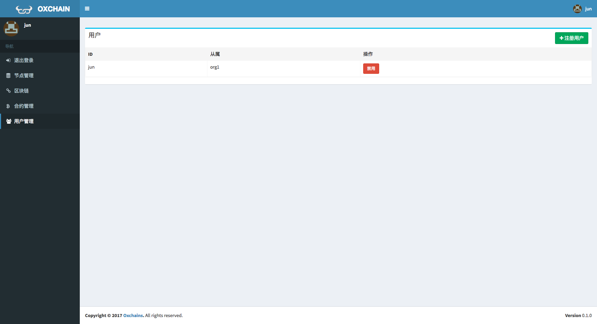

# fabric-manage
hyperledger fabric chain management web console

## [chain-console](./chain-console)

backend with RESTful API for:
  - peer node: start, stop, status(network, operation, etc.)
  - chain(channel): create, join, blockinfo
  - ca user: login(enroll), register, revoke
  - chaincode: upload, delete, install(deploy), instantiate, invoke and query
  

## [FrontEnd](./FrontEnd)

### Getting Started

Checkout this repo, install dependencies, then start the app with the following:

```
> git clone git@github.com:zkjs/fabric-manage.git
> cd fabric-manage/FrontEnd
> npm install
> npm start
```

##### 配置  

```
将 ./src/actions/types.js 中 ROOT_URL 修改为API服务器地址
```

### How to deploy 
```
> Requirements: NPM
> git clone git@github.com:zkjs/fabric-manage.git
> cd fabric-manage/FrontEnd
> modify ./src/actions/types.js , change ROOT_URL to right api server endpoint
> npm install
> npm install -g webpack
> webpack -p
> copy files index.html, bundle.js and directory public/  to any web server directory
> done
```

### 截屏

###### 节点
   
    
   
 
###### 区块链  
   
     
 
###### 用户
   
   
